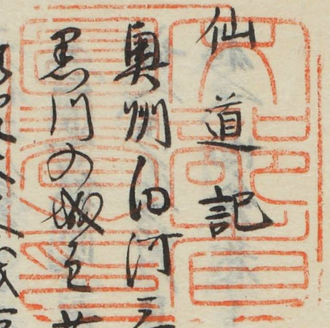
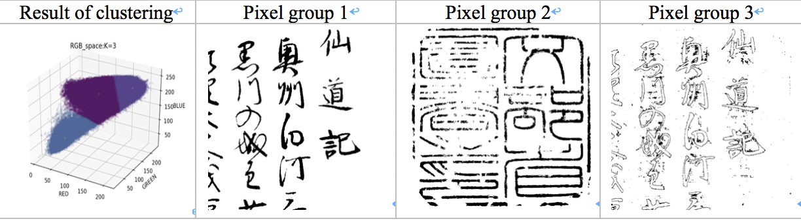
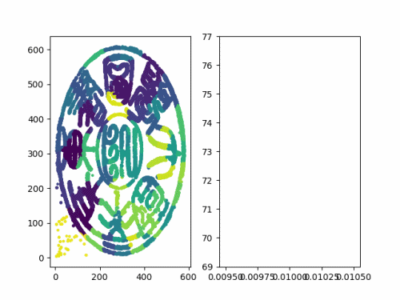

# collector-s_seal-ImageProcessing
This is a simple demo for processing stamp images.

In classical materials, seals are often covered by handwritten words.



To split the seal areas from background ,we can project RGB three channels information of image into three-dimensional space

automatically extracts areas with more red components by using k-means clustering


-------

The default value of K is 4.

run:
```python
python3 Binarization.py --ImageSelecter=imageDir(default='test.jpg') --clusters=K
Ex.python Binarization.py --ImageSelecter=test.jpg  --clusters=4

```
to get results of Binarization.The generated file will be named Binarization(0-n).jpg
Select the file you want to segment to single character.
run:
```python
python3 SealsCharacters_Segmentation.py --ImageSelecter=imageDir(default='Binarization2.jpg') 
Ex.python3 SealsCharacters_Segmentation.py --ImageSelecter=Binarization2.jpg
```
Then you can see the Characters Segmentation result in the result folder.



Authors
-------

- @Kangying Li 


License
-------
